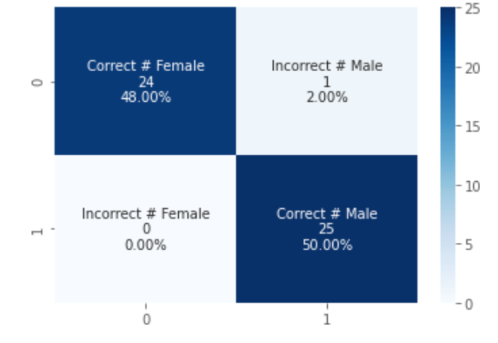
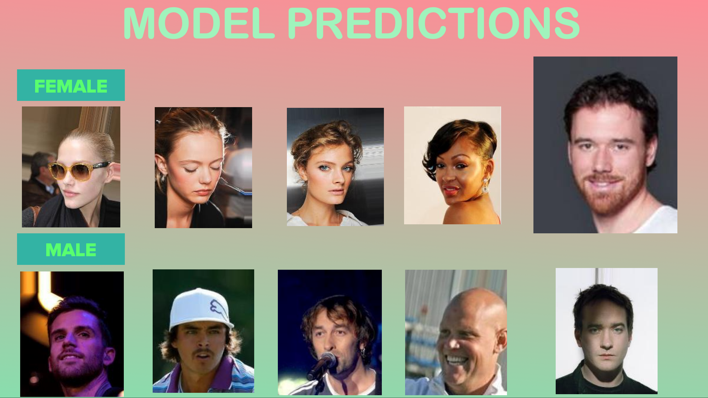

# Gender Predictor

## Motivation 
Maasdchine learning techniques to improve gender prediction in gender based marketing are a popular way for companies to improve targeted advertising campaigns. What I'm going to discuss is a sensitive topic. My attempt is in no way trying to pass judgment on gender or create social gaps. Everyone has a different idea of what gender means to them. For the vast majority of Americans, the gender they identify with is what they are born with. The goal of this model is to capture what gender you portray yourself as, regardless of your gender at birth. 

Gender based marketing is a very popular way for companies to market their products. Advertisers currently use this to market appropriate ads for higher revenue. My aim is to help companies better target their advertising toward a specific gender with gender based marketing. This can be as simple as finding which areas of a mall or store have higher gender specific traffice and thereby placing appropriate ads or products to increase likelihood of a sale.

## Data

* The dataset consists of over 202, 599 face images of various celebrities. The data was originally collected by   
 [researchers at MMLAB, The Chinese University of Hong Kong](https://mmlab.ie.cuhk.edu.hk/projects/CelebA.html). 

* I narrowed down the images to 225 male images and 225 female images. The data set is balanced.

## Model Selection

* The model I selected is **Xception CNN**. It produces the highest accuracy when compared to Vgg-16, Resnet-152, and Inception V3. Xception is a pretrained model trained on approximately **1.2** million images. The pretrained network can classigy images into 1000 object categories. Xception is 71 layers deep. Xception has entry, middle and exit flow architecture. 

    

* Xception is the extreme version of Inception because it uses **depthwise separable convolutions**(see image above). It transforms the image once in the depthwise convolution and then the image is elongated by the number of channels. Computational power is saved since the image is not being transformed over and over again which happens in a normal convolution. The 1 to 1 convolution is done first and then spatial convolutions are done afterwards.

## Predictions

* The confusion matrix below shows we correctly identified all images except for one incorrect male that was classified as a female. I achieved a very high accuracy and F1 score at **98%.** For a company marketing in a mall this model would work well in providing gender based ads with high accuracy predictions.

    
    
* The below predictions are results from the test images. The incorrect female classification is the larger image on the far right. This image should have been classified as a male. The rest of the pictures are correct and show that females with short hair are correctly classified. Male images are correctly classified despite some shading on the far left and right pictures.

    

## Next Steps

I had good results with the pilot project but I'd like to increase the number of images. Reducing bias is crucial in gender based predictions. Adding images that include all visual ways to portray both genders should be included in future models. 

## Consequences

What are the consequences of misclassified images? There are ethical concerns. If the public found out that a company used their image to dish them certain ads, this may create major backlash, especially if the images are not properly classified. The public may not want to buy their products in the future. Any company planning to use gender based predictions in their marketing compaign needs to evaluate ethical concerns, find ways to reduce bias, and if they plan to go ahead with this technique, find ways to improve their data. This could mean to go out in societty and see how people currently classify themslves by their appearance and add that intelligence to the model. 

## Live Demo

Using Flask, I created a live demo to show how my model performs on different types of images. I tested four sets of images: myself, a colleague, and 2 famous transgender celebrities. I tested Kaitlyn Jenner, a transgender female running for CA governer and transgender male Chaz Bono, Cher's son. All four images classified correctly in my model. 

## Resources

[Celeb Images Dataset](https://mmlab.ie.cuhk.edu.hk/projects/CelebA.html)

[Xception Model](https://stephan-osterburg.gitbook.io/coding/coding/ml-dl/tensorfow/ch3-xception/xception-architectural-design)

            
            

        